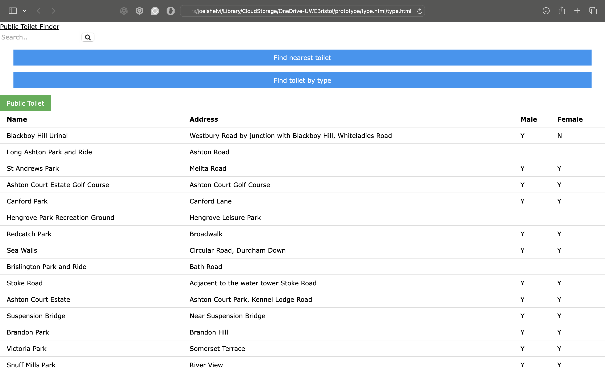
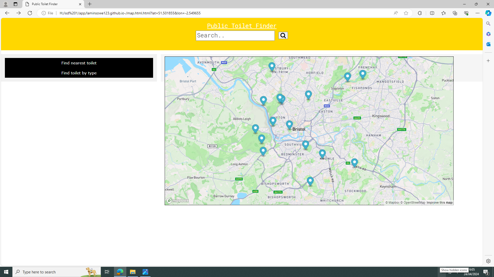

# Deployment

## Release Notes
Public Toilet finder, version 1.0. For this website, we used a range of system dependencies. For the map service, we used Mapbox for free and precise mapping . We used HTML, CSS and JavaScript on Visual studio code for the frontend work. Bristol Open data played a huge part in providing us with the data set and public toilet locations  to incorporate into our website.

![Insert Deployment diagram here
]

# User guide
This Use Case is used to find the public toilet by a list. In the photo below, it shows the different names of the public toilets, the address and also shows if there is availability for male or female users. this will be beneficial for the user as they can plan their journey according to the availability of the public toilet. 

This use case is for the user to be able to find a public toilet by map, the photo below displays a map that requires the location of the user, and show markings of the diffrent public toilets in Bristol. If you click on the markers, you are able to see the name of the public toilets. this will be beneficial for the user as they can plan thier jouney beforehand to get the best route.

