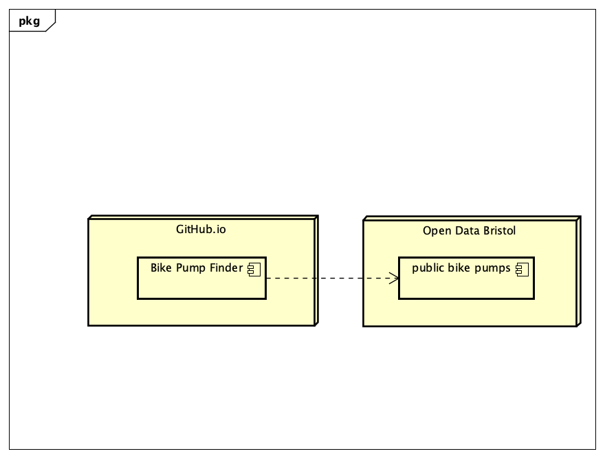

# Deployment

## Release Notes
TODO: Describe the current version of the system (with version number. Include system dependencies ands software tools used.
Are there any known issues? 
Describe the deployment of software components to hardware nodes using a UML Deployment diagram.

# User guide
This Use Case is used to find the public toilet by a list. In the photo below, it shows the different names of the public toilets, the address and also shows if there is availability for male or female users. this will be beneficial for the user as they can plan their journey according to the availability of the public toilet. 

TODO: Repeat as necessary
