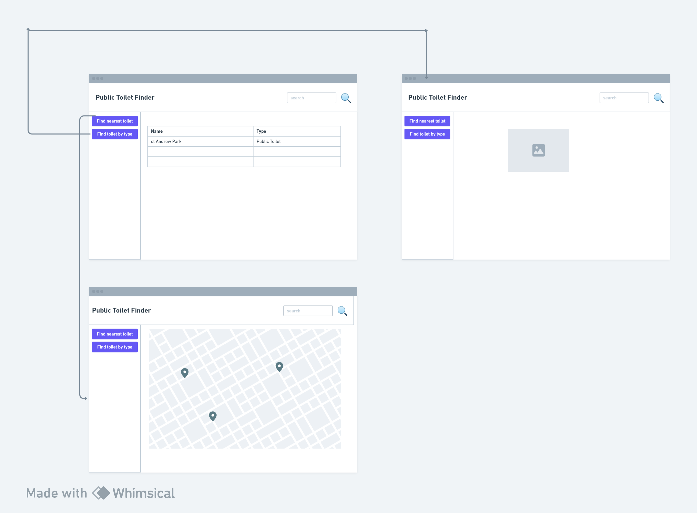

# Design

## User Interface design

The user interface design is a crucial aspect of the public toilet finder system, as it directly impacts the user experience and usability of the platform. The following is a proposed design for the user interface:

1. Search Bar - The search bar is the primary means of finding public toilets. Users can enter a location or address to search for nearby public toilets.
2. Map View - The map view displays the search results as markers on a map. Users can click on a marker to view more information about a public toilet, such as its address, opening hours, and accessibility features.
3. List View - The list view displays the search results as a list, with each item showing the name, address, and distance from the user's current location.
