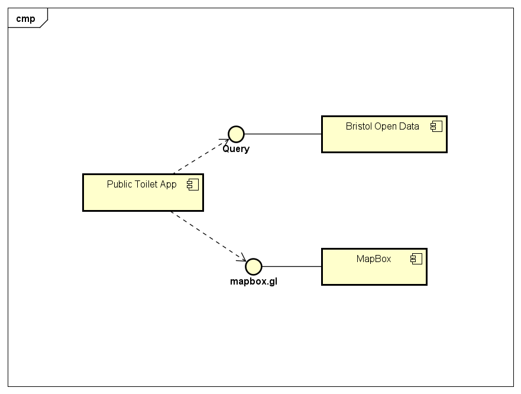
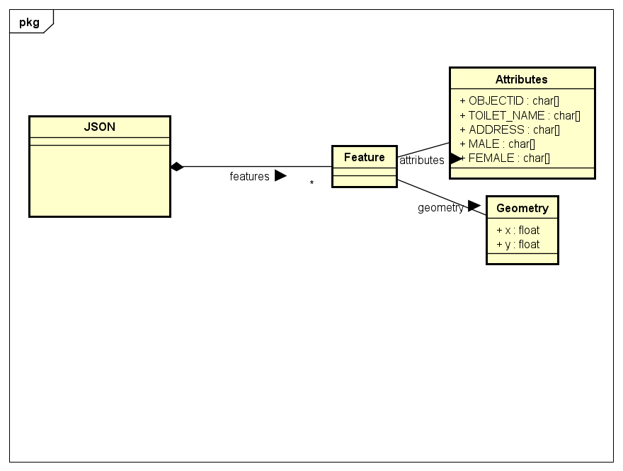

# Implementation

## Introduction
TODO: Describe the system implemented (Describe the dataset. Are there any known issues? Describe any configuration data).

## Project Structure
The main app is directed in the app folder and index.html.html is the splash page. An experimental early version of the of the prototype can be found in the prototype folder.  

```
├── app
│   ├── distance.html.html
│   ├── index.html.html
│   └── map.html.html
│   ├── script.js
│   └── style.css
│   └── search.html
│   └── type.html    
├── prototype
├── test
└── readme.md
```

This is the lint output for script.js. The function 'getLocation' is provided as a library function and is used elsewhere. The 'navigatior' object is provided within the web browser. the 'console' object is provided within the web browser.
```
Error
1:16

'getLocation' is defined but never used.  (no-unused-vars)
Error
4:7

'navigator' is not defined.  (no-undef)
Error
7:9

'navigator' is not defined.  (no-undef)
Error
15:7

'console' is not defined.  (no-undef)
Error
23:5

'console' is not defined.  (no-undef)
Error
31:3

'location' is not defined.  (no-undef)
Error
31:34

'URLSearchParams' is not defined.  (no-undef)
```

## Software Architecture
The main app uses data from Bristol Open Data, and uses maps supplied by Mapbox. This is a service-orientated architecture.



## Bristol Open Data API



