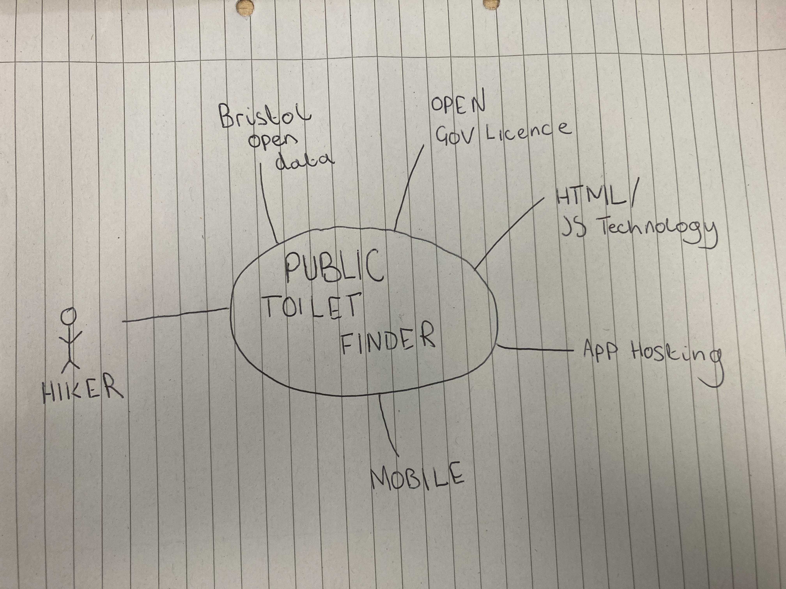

# Project Proposal

## Business Case

### Problem statement
In the modern world, being able to access clean and easy to find public toilet can be a burden upon hikers and even local residents. Not being able to have these platforms to make public toilets easy to find can result in distress, difficulty and even health hazards.

### Business benefits
1. Easy to find public toilets - The project can draw and keep people by providing an easy-to-use method for finding nearby public restrooms.

2. user engagement- Increasing platform usage and user loyalty through improved user engagement can lead to  growth and the attraction of new customers.

3. ability to access anywhere- Universal accessibility broadens the user base, increasing the platform's reach and potential and growth.

### Options Considered
1. Google maps-  Google Maps frequently offer details on public restrooms in the area.  
2. Government websites- Public restroom locations are listed in databases kept by numerous local and federal governments. 
3. Google search- Google search frequently provide information about public restrooms in the area.

### Expected Risks
1. Data accuracy- ensuring that the data regarding the locations of public restrooms is accurate.
2. Data updates- ensuring that the data regarding the locations of public restrooms is up to date
3. Competition- There are already specialised apps and well-established competitors in the market for restroom-finding services, so it could be competitive.
4. technical problems- Problems with data integration, mapping, and user interface design could come up.

## Project Scope
The scope of the system of interest includes the following components:

1. User interface for searching and displaying public toilets.
2. Integration with mapping services to display toilet locations.
3. Database of public toilet locations and attributes.
4. Data update mechanism to ensure data accuracy and freshness.

                                      +---------------+
                                      |  User        |
                                      +---------------+
                                             |
                                             |
                                             v
                                      +---------------+
                                      |  User Interface  |
                                      +---------------+
                                             |
                                             |
                                             v
                                      +---------------+
                                      |  Mapping Service  |
                                      +---------------+
                                             |
                                             |
                                             v
                                      +---------------+
                                      |  Database        |
                                      +---------------+
                                             |
                                             |
                                             v
                                      +---------------+
                                      |  Data Update     |
                                      +---------------+
                                             |
                                             |
                                             v
                                      +---------------+
                                      |  Government APIs  |
                                      +---------------+
                                             |
                                             |
                                             v
                                      +---------------+
                                      |  Open Data Sources|
                                      +---------------+

