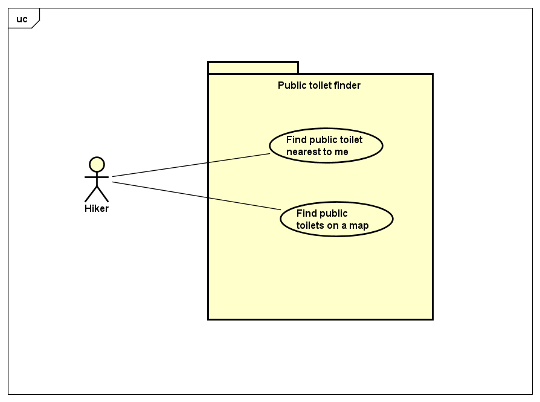
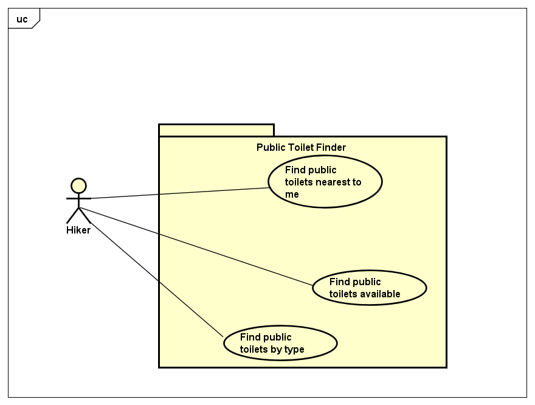

# Requirements

## User Needs

### User stories
As a hiker I would want to find a public toilet on a map incase I get lost

As a hiker I would want to see all the public toilets on a list so that I can plan my hike 

### Actors
Hiker - Long distance walker

### Use Cases

| UC1| PUBLIC TOILET FINDER| 
| -------------------------------------- | ------------------- |
| **Description** | To be able to find nearest public toilet on a map |
| **Actors** |Hikers|
| **Assumptions** | </td>None</tr>
| **Steps** |  <ol><li>Have the ability to see the public toilets on a map</li><li>Request access for the users location</li><li>Get permission for geo location</li><li>Get nearest public toilets from the database</li><li>See the nearest public toilets on a map</li><ol>|
| **Variations** |  |
| **Non-functional** |OPTIONAL - List of non-functional requirements that the use case must meet. |
| **Issues** | |

| UC2| PUBLIC TOILET FINDER| 
| -------------------------------------- | ------------------- |
| **Description** | To be able to find nearest public toilet on a list|
| **Actors** |Hikers|
| **Assumptions** | </td>None</tr>
| **Steps** |  <ol><li>Have the ability to see the public toilets on a list</li><li>Request access for the users location</li><li>Get permission for geo location</li><li>Get nearest public toilets from the database</li><li>See the nearest public toilets on a list</li><ol>|
| **Variations** |  |
| **Non-functional** | 
| **Issues** | |

## Software Requirements Specification
### Functional requirements 
Use Case 1- 
**FR1.1**    The system should get permission to access user location via geolocation object. 
**FR1.2**    The system should query the database for public toilets location from Open Data Bristol. 
**FR1.3**    The system should centre the map on the user location using the map object. 
**FR1.4**   The system should add markers for public toilets using the map object. 

Use Case 2- 
**FR1.1**   The system should recieve an access entry to the user location via geolocation object. 
**FR1.2**   The system should query the database for list of public toilets via location from Open Data Bristol. 
**FR1.3**   The system should centre the list in the user location area with aid of a map object. 
**FR1.4**   The system should support the addition of markers for a public toilet list using the map object.

### Non-Functional Requirements
Use Case 1- 
**NFR1.1**    The app should work on android devices(portability) 
**NFR1.2**    The app should show the public toilet within 1 mile(usability) 
**NFR1.3**    If denied acces to user location, centre to Bristol City Cntre (reliability) 
**NFR1.4**    should load the public toilets within 5 secs(performability) 

Use Case 2- 
**NFR1.1**    The app should work on chrome and safari browsers(compatibility) 
**NFR1.2**    The data on the list should be up to date/no more than 1 year old(functional suitability) 
**NFR1.3**    No security requirments(security) 
**NFR1.4**    straight forward updates on lists(maintainability) 
